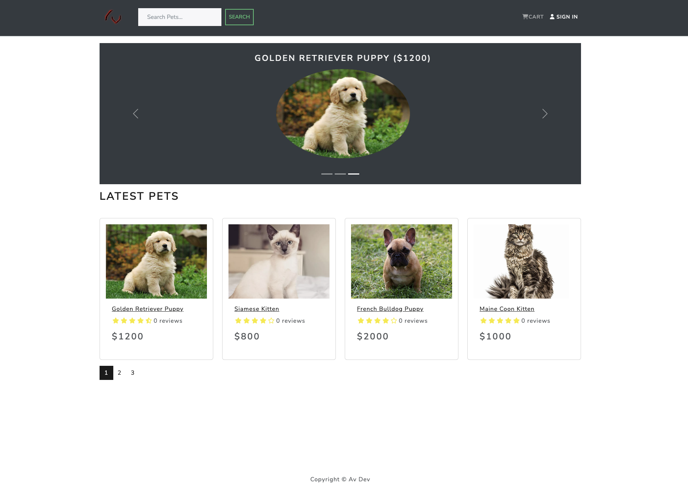
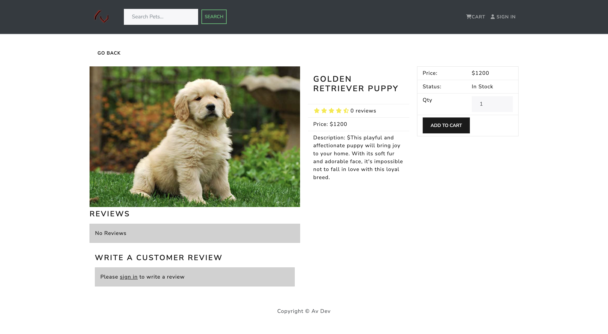
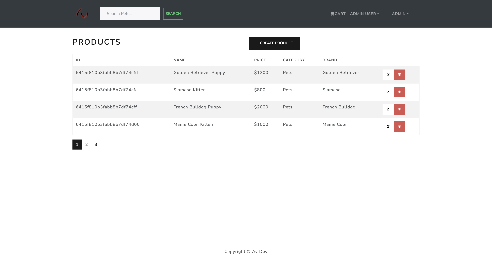
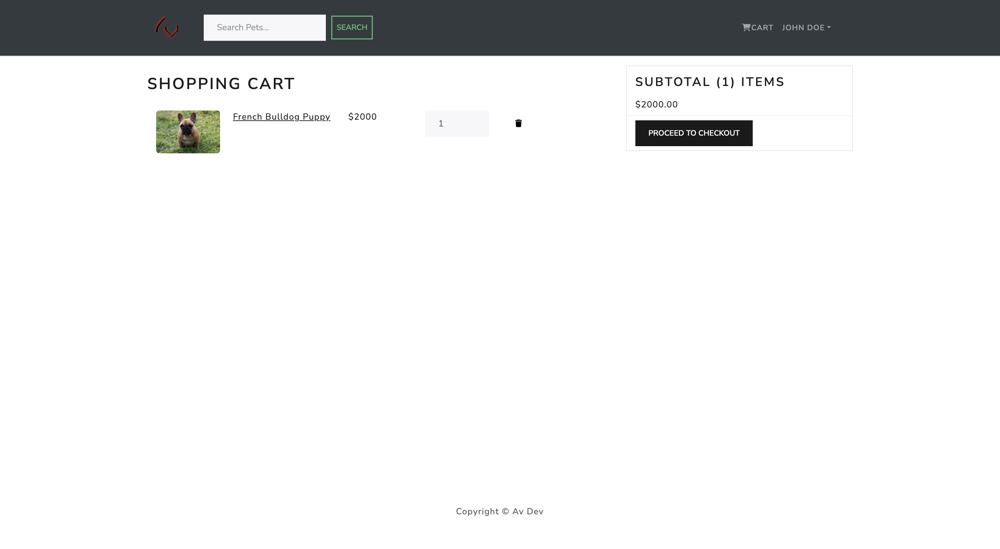
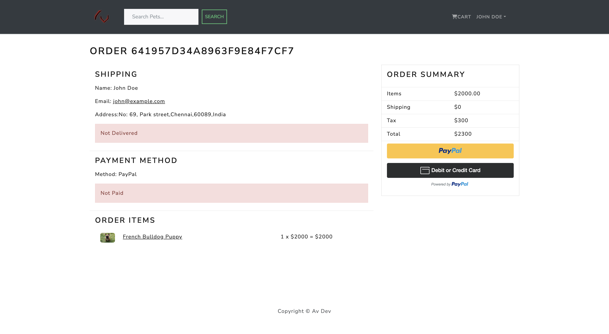

# AV Pets

AV Pets is an online platform where users can buy pets and merchants can sell pets. This application is built with the MERN stack and utilizes React Bootstrap for styling.

## Live Demo

Check out the live demo of AV Pets [here](https://av-pets-mern-git-master-vimalds15.vercel.app/).

## Tech Stack

- MongoDB: Database
- Express: Backend framework
- React: Frontend library
- Node.js: Runtime environment
- React Bootstrap: UI components

## Screens

The following screens are available in AV Pets:

### Home Screen

The Home Screen displays featured pets and a search bar for finding pets.

### Product Screen

The Product Screen displays detailed information about a selected pet, including price, description, and seller information.

### Admin Screen

The Admin Screen is accessible only to merchants and provides tools for managing their pet listings and sales.

### Cart Screen

The Cart Screen displays items that the user has added to their shopping cart and allows them to adjust quantities or remove items before checkout.

### Payment Screen

The Payment Screen allows users to securely enter their payment information and complete their purchase.

## Installation

To run AV Pets on your local machine, follow these steps:

1. Clone the repository.
2. Install dependencies with `npm install`.
3. Start the server with `npm start`.
4. Open `http://localhost:3000` in your web browser.

## Credits

AV Pets was created by [Anto Vimalan]. If you have any questions or feedback, please reach out to [antovimalands@gmail.com].
